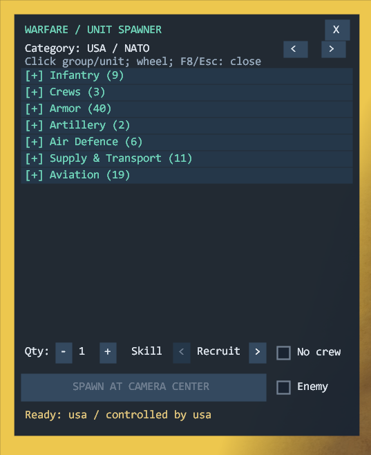
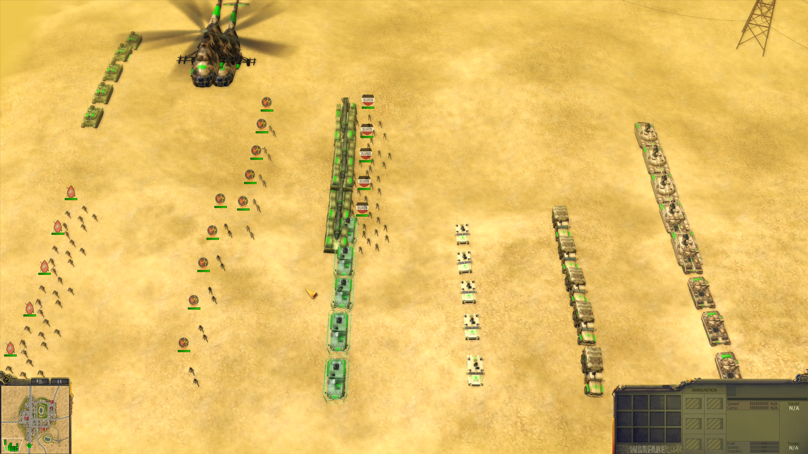

# Warfare (2008) — Spawn UI

[English](README.md)

Создание юнитов возле камеры через панель F8. Версия **1.0.0**. На момент публикации мод работал корректно.

**Мод проверен только на Steam-версии Warfare 1.0.8.0 для Windows x86 с английской локализацией. Другие издания и локализации не проверялись.**

## Возможности

- 200 прототипов в USA / NATO, Arab forces и Neutral; семь раскрывающихся групп: Infantry, Crews, Armor, Artillery, Air Defence, Supply & Transport и Aviation.
- Создание 1–20 юнитов для текущего игрока или с включённым **Enemy**. Каталог не определяет владельца; враги автоматически не выделяются.
- **No crew** создаёт нейтральную пустую технику, включая вертолёты на земле. Для техники перекрывает Enemy; пехота и отдельные отряды экипажей не затронуты.
- **Skill**: Recruit, Able, Regular, Expert, Veteran, Elite. Применяется к пехоте и экипажам техники; для пустой техники пропускается.
- Наземные кольца показывают примерное размещение; точные позиции выбирает игра. Enemy делает кольца красными, в том числе при включённом No crew.

## Установка

1. Используйте `warfare-spawn-ui-1.0.0-windows-x86.zip`; архивы GitHub «Source code» содержат только документы. Сверьте ZIP с файлом `.sha256`.
2. Распакуйте в корень Warfare рядом с `bin` и `basis`: `mods/spawn-ui/spawn-ui-launcher.exe`.
3. Запустите игру, загрузите миссию, затем запустите launcher с такими же правами, как у игры.
4. Вернитесь в игру и нажмите **F8**.

## Управление

F8 открывает/закрывает панель; Esc или X закрывает её. Нажимайте на заголовки групп и юниты; прокручивайте колёсиком. Используйте стрелки Category, Qty −/+ и стрелки Skill, затем **SPAWN AT CAMERA CENTER**.

Панель работает только в тактической миссии, включая паузу. Закройте её для управления юнитами. Enemy, No crew и Skill сохраняются при закрытии и смене каталога; новая миссия сбрасывает их в выключено/выключено/Recruit. Смена каталога или миссии сбрасывает список; выбранный каталог сохраняется между миссиями.

## Ограничения и диагностика

F8 сохраняет штатное назначение **Quick load**. Размещение не гарантирует свободного места. Созданные юниты могут попасть в сохранение, если сохранить миссию.

Перед заменой файлов полностью закройте игру; новая DLL требует перезапуска. Для игры без мода не запускайте launcher. Для удаления закройте игру и удалите `mods/spawn-ui`.

При ошибке подключения проверьте версию игры, расположение файлов и права процессов. Сообщение «DLL загружена» само по себе не подтверждает инициализацию. Журналы `bridge.log` и `launcher.log` находятся в папке мода. Сообщите шаги воспроизведения и удалите личные пути перед передачей журналов.

[Известные проблемы](KNOWN_ISSUES.ru.md)
